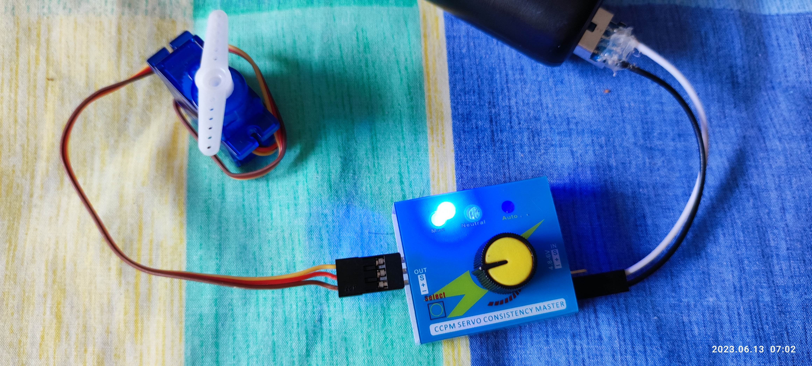
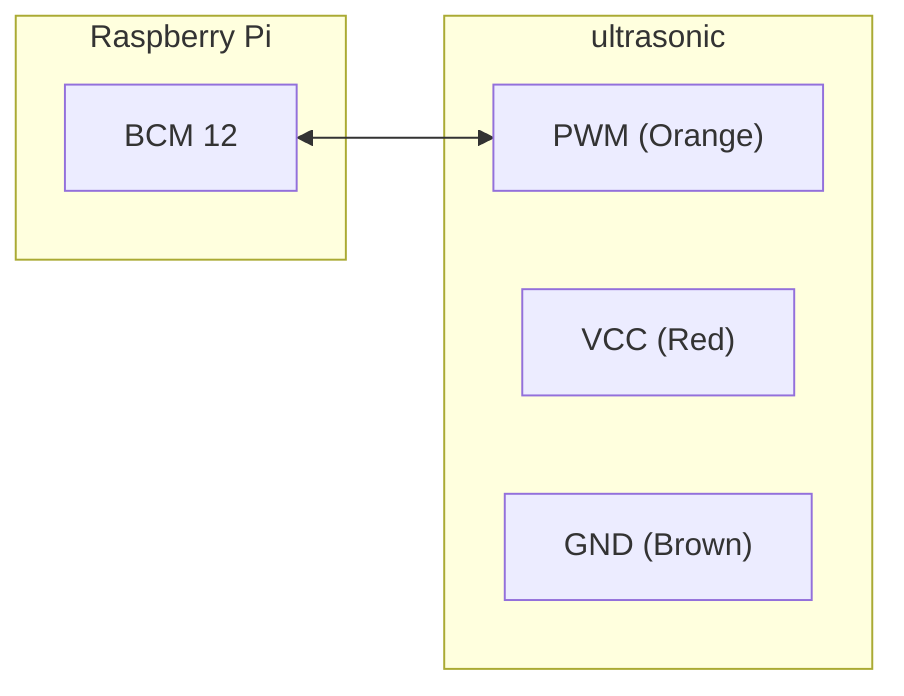
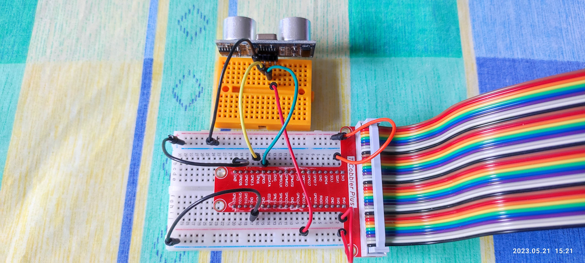
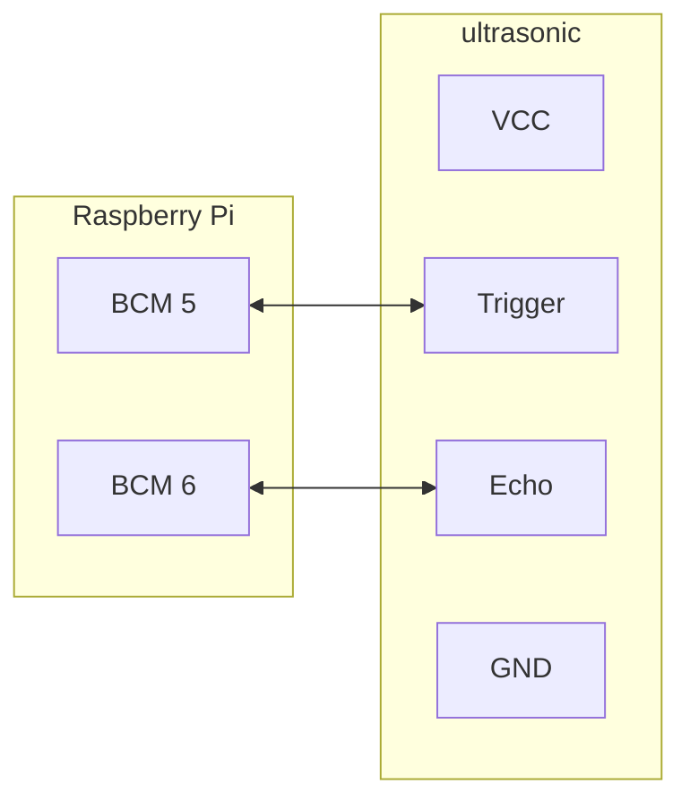
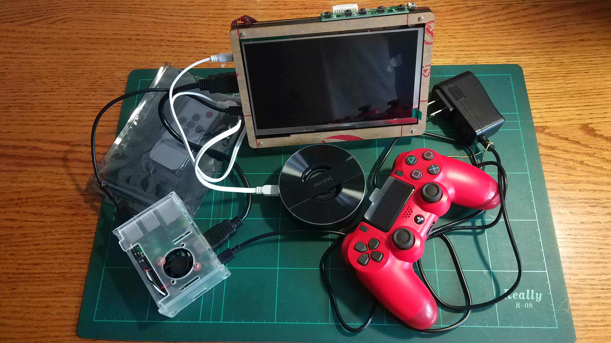
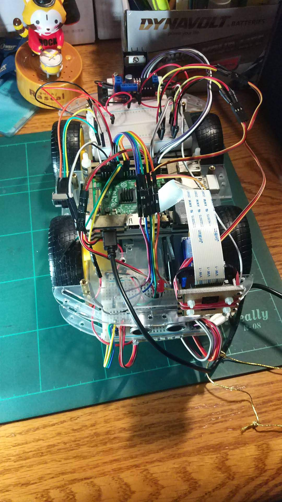

# 1. Overview

RPiP9 把 Raspberry Pi 上常見的模組搜集而成。

當然你會覺得網路上有，為什麼還寫出這些範例？

網路上都是以課程為單位在教學，完全沒有思慮 busy loop、multi thread、資源交換，甚至是程式碼共用等問題。

不敢說自己寫的很完美，至少會用我在業界的態度來撰寫。

# 2. Depend on

- [netifaces (0.11.0)](https://pypi.org/project/netifaces/)

- [RPi.GPIO (0.7.1)](https://pypi.org/project/RPi.GPIO/)

- [pigpio (1.78)](https://pypi.org/project/pigpio/)

# 3. Current Status


# 4. Build
```bash
Do nothing
```
# 5. Example or Usage

#### - servo_123.py : [SG90](https://datasheetspdf.com/pdf/791970/TowerPro/SG90/1)(180 degree Rotation) servo motor example

> a frequency of 50Hz. That frequency was selected because the servo motor expect a pulse every 20ms (period), that means 50 pulses per second or Hertz.






| api         | Codes                                                        | freq | min                       | max                        | step |
| ----------- | ------------------------------------------------------------ | ---- | ------------------------- | -------------------------- | ---- |
| GPIO.PWM    | gpioX["pwm"] = GPIO.PWM(gpioX["bcmid"], gpioX["freq"])<br>gpioX["pwm"].start(0)<br>gpioX["pwm"].ChangeDutyCycle(dutyCycle) | 330  | 0                         | 100                        | 1    |
| GPIO.PWM    |                                                              | 50   | 2.5<br>(50/20)            | 12.5<br>(250/20)           | 0.05 |
| pigpio.pi() | gpioX["pwm"] = pigpio.pi()<br>gpioX["pwm"].hardware_PWM(gpioX["bcmid"], gpioX["freq"], dutyCycle) |      | 25000<br>(1000000*0.5/20) | 120000<br>(1000000*2.4/20) | 950  |
|             |                                                              |      |                           |                            |      |

```bash
$ make servo_123.py
----->> layer_python - /work/codebase/lankahsu520/RPiP9/python


----->> run servo_123.py
PYTHONPATH=/work/codebase/lankahsu520/RPiP9/python ./servo_123.py -d 3
[4320/0000] servo_api.py|threadx_handler:0114 - looping tilt...
[4320/-001] rpip9gpio.py|linkGPIO:0045 - call GPIO.setmode ... (gpioXmode: 11)
[4320/-001] rpip9gpio.py|linkGPIO:0063 - CONTROL_HW (key: tilt, bcmid: 12, direction: 0)
[4320/-001] rpip9gpio.py|linkGPIO:0065 - pwmAngle (HW) (key: tilt, def: 72500)
[4320/-001] servo_api.py|keyboard_recv:0144 - press q to quit the loop (z:tilt, x:pan, ←:left, ↑:up, →:right, ↓:down) ...
[4320/0000] servo_api.py|servo_angle_helper:0055 - (key: tilt, min_angle: 25000, val: 72500, max_angle: 120000)
[4320/-001] rpip9gpio.py|pwmAngle:0102 - pwmAngle (HW) (key: tilt, angle: 72500, dutyCycle: 72500)
[4320/-001] servo_api.py|servo_angle_helper:0055 - (key: tilt, min_angle: 25000, val: 73450, max_angle: 120000)
[4320/-001] rpip9gpio.py|pwmAngle:0102 - pwmAngle (HW) (key: tilt, angle: 73450, dutyCycle: 73450)
[4320/-001] servo_api.py|servo_angle_helper:0055 - (key: tilt, min_angle: 25000, val: 74400, max_angle: 120000)
[4320/-001] rpip9gpio.py|pwmAngle:0102 - pwmAngle (HW) (key: tilt, angle: 74400, dutyCycle: 74400)
[4320/-001] servo_api.py|servo_angle_helper:0055 - (key: tilt, min_angle: 25000, val: 75350, max_angle: 120000)
[4320/-001] rpip9gpio.py|pwmAngle:0102 - pwmAngle (HW) (key: tilt, angle: 75350, dutyCycle: 75350)
[4320/-001] servo_api.py|release:0170 - (is_quit: 0, gpioXlnk: 1)
[4320/-001] servo_api.py|release:0183 - call GPIO.cleanup ...
[4320/-001] servo_123.py|main:0123 - Bye-Bye !!! (is_quit: 1)

```


#### - ultrasonic_123.py : ultrasonic example





```bash
 $ make ultrasonic_123.py
----->> layer_python - /work/codebase/lankahsu520/RPiP9/python


----->> run ultrasonic_123.py
PYTHONPATH=/work/codebase/lankahsu520/RPiP9/python ./ultrasonic_123.py -d 3
[7089/0000] rpip9gpio.py|linkGPIO:0043 - call GPIO.setmode ... (gpioXmode: 11)
[7089/-001] rpip9gpio.py|linkGPIO:0061 - call GPIO.setup - CONTROL_NORMAL ... (key: trigger, bcmid: 5, direction: 0)
[7089/-001] rpip9gpio.py|linkGPIO:0061 - call GPIO.setup - CONTROL_NORMAL ... (key: echo, bcmid: 6, direction: 1)
[7089/-001] ultrasonic_api.py|threadx_handler:0109 - looping ... (use_edge: 2, trigger: 5, echo: 6)
[7089/-001] ultrasonic_api.py|threadx_handler:0113 - call add_event_detect ...
[7089/-001] ultrasonic_api.py|startx:0152 - (pause: 1, use_edge: 2)
[7089/-001] ultrasonic_api.py|keyboard_recv:0176 - press q to quit the loop (enter:start, space:pause) ...
[7089/-001] ultrasonic_api.py|watch:0053 - (distance: 7.2577595710754395 cm)
[7089/-001] ultrasonic_api.py|watch:0053 - (distance: 9.073221683502197 cm)
[7089/-001] ultrasonic_api.py|watch:0053 - (distance: 10.303974151611328 cm)
[7089/-001] ultrasonic_api.py|watch:0053 - (distance: 9.392154216766357 cm)
[7089/-001] ultrasonic_api.py|watch:0053 - (distance: 9.159088134765625 cm)
[7089/-001] ultrasonic_api.py|watch:0053 - (distance: 9.6701979637146 cm)
[7089/-001] ultrasonic_api.py|watch:0053 - (distance: 9.179532527923584 cm)
[7089/-001] ultrasonic_api.py|watch:0053 - (distance: 9.085488319396973 cm)
[7089/-001] ultrasonic_api.py|watch:0053 - (distance: 9.416687488555908 cm)
[7089/-001] ultrasonic_api.py|watch:0053 - (distance: 8.316779136657715 cm)
[7089/-001] ultrasonic_api.py|watch:0053 - (distance: 9.608864784240723 cm)
[7089/-001] ultrasonic_api.py|watch:0053 - (distance: 9.64975357055664 cm)
[7089/-001] ultrasonic_api.py|watch:0053 - (distance: 5.973851680755615 cm)

```
# 6. License

RPiP9 is under the New BSD License (BSD-3-Clause).


# 7. Documentation
Run an example and read it.





# Appendix

# I. Study

## I.1. [Servo Motor Control Using Raspberry Pi](https://www.donskytech.com/servo-motor-control-using-raspberry-pi/)

# II. Debug

## II.1. Can’t connect to pigpio at localhost(8888)

```bash
$ sudo vi /lib/systemd/system/pigpiod.service
ExecStart=/usr/bin/pigpiod -l -n 127.0.0.1

$ sudo netstat -tulpn | grep pigpiod
$ sudo service pigpiod start
$ sudo systemctl status pigpiod
$ sudo systemctl enable pigpiod
```

# III. Glossary