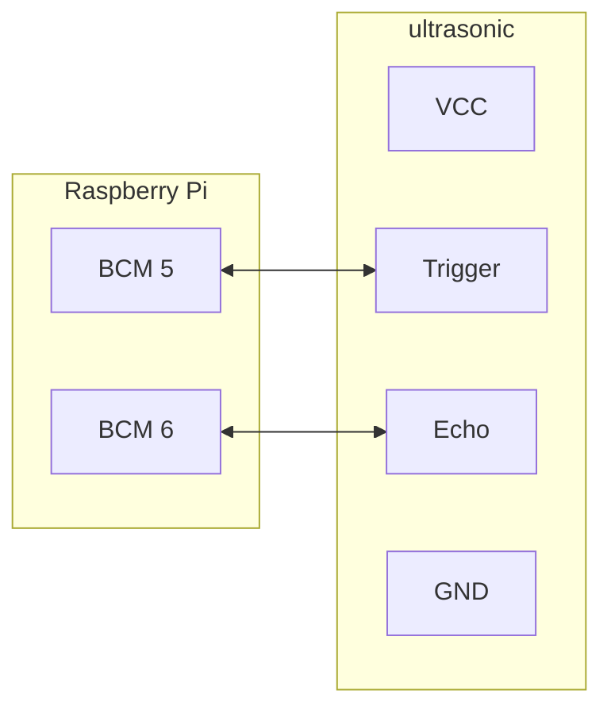

# 1. Overview

RPiP9 把 Raspberry Pi 上常見的模組搜集而成。

當然你會覺得網路上有，為什麼還寫出這些範例？

網路上都是以課程為單位在教學，完全沒有思慮 busy loop、multi thread、資源交換，甚至是程式碼共用等問題。

不敢說自己寫的很完美，至少會用我在業界的態度來撰寫。

# 2. Depend on

- [netifaces (0.11.0)](https://pypi.org/project/netifaces/)

- [RPi.GPIO (0.7.1)](https://pypi.org/project/RPi.GPIO/)

# 3. Current Status


# 4. Build
```bash
Do nothing
```
# 5. Example or Usage

#### - ultrasonic_123.py : ultrasonic example




```bash
 $ make ultrasonic_123.py
----->> layer_python - /work/codebase/lankahsu520/RPiP9/python


----->> run ultrasonic_123.py
PYTHONPATH=/work/codebase/lankahsu520/RPiP9/python ./ultrasonic_123.py -d 3
[7089/0000] rpip9gpio.py|linkGPIO:0043 - call GPIO.setmode ... (gpioXmode: 11)
[7089/-001] rpip9gpio.py|linkGPIO:0061 - call GPIO.setup - CONTROL_NORMAL ... (key: trigger, bcmid: 5, direction: 0)
[7089/-001] rpip9gpio.py|linkGPIO:0061 - call GPIO.setup - CONTROL_NORMAL ... (key: echo, bcmid: 6, direction: 1)
[7089/-001] ultrasonic_api.py|threadx_handler:0109 - looping ... (use_edge: 2, trigger: 5, echo: 6)
[7089/-001] ultrasonic_api.py|threadx_handler:0113 - call add_event_detect ...
[7089/-001] ultrasonic_api.py|startx:0152 - (pause: 1, use_edge: 2)
[7089/-001] ultrasonic_api.py|keyboard_recv:0176 - press q to quit the loop (enter:start, space:pause) ...
[7089/-001] ultrasonic_api.py|watch:0053 - (distance: 7.2577595710754395 cm)
[7089/-001] ultrasonic_api.py|watch:0053 - (distance: 9.073221683502197 cm)
[7089/-001] ultrasonic_api.py|watch:0053 - (distance: 10.303974151611328 cm)
[7089/-001] ultrasonic_api.py|watch:0053 - (distance: 9.392154216766357 cm)
[7089/-001] ultrasonic_api.py|watch:0053 - (distance: 9.159088134765625 cm)
[7089/-001] ultrasonic_api.py|watch:0053 - (distance: 9.6701979637146 cm)
[7089/-001] ultrasonic_api.py|watch:0053 - (distance: 9.179532527923584 cm)
[7089/-001] ultrasonic_api.py|watch:0053 - (distance: 9.085488319396973 cm)
[7089/-001] ultrasonic_api.py|watch:0053 - (distance: 9.416687488555908 cm)
[7089/-001] ultrasonic_api.py|watch:0053 - (distance: 8.316779136657715 cm)
[7089/-001] ultrasonic_api.py|watch:0053 - (distance: 9.608864784240723 cm)
[7089/-001] ultrasonic_api.py|watch:0053 - (distance: 9.64975357055664 cm)
[7089/-001] ultrasonic_api.py|watch:0053 - (distance: 5.973851680755615 cm)

```
# 6. License

RPiP9 is under the New BSD License (BSD-3-Clause).


# 7. Documentation
Run an example and read it.


