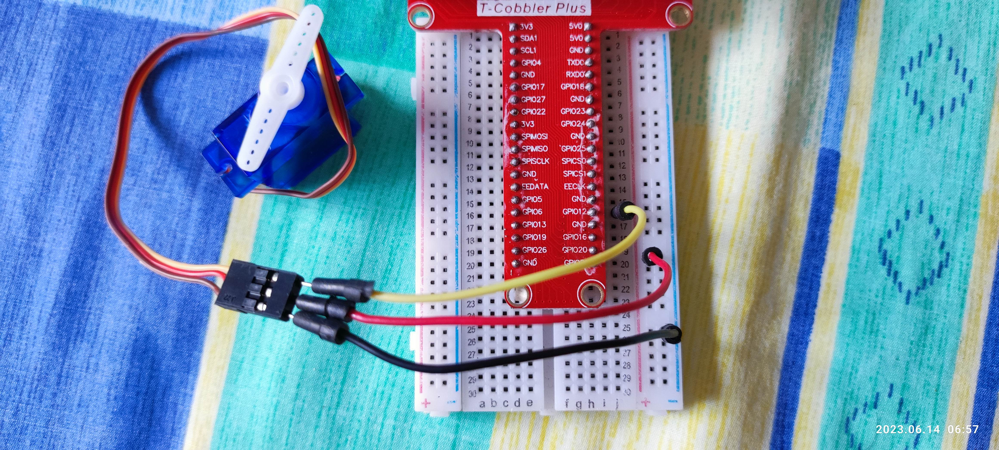

# 1. Overview

RPiP9 把 Raspberry Pi 上常見的模組搜集而成。

當然你會覺得網路上有，為什麼還寫出這些範例？

網路上都是以課程為單位在教學，完全沒有思慮 busy loop、multi thread、資源交換，甚至是程式碼共用等問題。

不敢說自己寫的很完美，至少會用我在業界的態度來撰寫。

# 2. Depend on

- [netifaces (0.11.0)](https://pypi.org/project/netifaces/)
- [RPi.GPIO (0.7.1)](https://pypi.org/project/RPi.GPIO/)
- [pigpio (1.78)](https://pypi.org/project/pigpio/)


# 3. Current Status


# 4. Build
```bash
Do nothing
```
# 5. Example or Usage

#### - servo_tilt_123.py : [SG90](https://datasheetspdf.com/pdf/791970/TowerPro/SG90/1) (180 degree Rotation), Micro Servo example

> a frequency of 50Hz. That frequency was selected because the servo motor expect a pulse every 20ms (period), that means 50 pulses per second or Hertz.





| api         | Codes                                                        | freq | min                       | max                        | step |
| ----------- | ------------------------------------------------------------ | ---- | ------------------------- | -------------------------- | ---- |
| GPIO.PWM    | gpioX["pwm"] = GPIO.PWM(gpioX["bcmid"], gpioX["freq"])<br>gpioX["pwm"].start(0)<br>gpioX["pwm"].ChangeDutyCycle(dutyCycle) | 330  | 0                         | 100                        | 1    |
| GPIO.PWM    |                                                              | 50   | 2.5<br>(50/20)            | 12.5<br>(250/20)           | 0.05 |
| pigpio.pi() | gpioX["pwm"] = pigpio.pi()<br>gpioX["pwm"].hardware_PWM(gpioX["bcmid"], gpioX["freq"], dutyCycle) |      | 25000<br>(1000000*0.5/20) | 120000<br>(1000000*2.4/20) | 950  |
|             |                                                              |      |                           |                            |      |

```bash
$ make servo_tilt_123.py
----->> layer_python - /work/codebase/lankahsu520/RPiP9/python


----->> run servo_tilt_123.py
PYTHONPATH=/work/codebase/lankahsu520/RPiP9/python ./servo_tilt_123.py -d 3
[26939/0000] servo_api.py|threadx_handler:0114 - looping tilt...
[26939/-001] rpip9gpio.py|linkGPIO:0045 - call GPIO.setmode ... (gpioXmode: 11)
[26939/-001] rpip9gpio.py|linkGPIO:0063 - CONTROL_HW (key: tilt, bcmid: 12, direction: 0)
[26939/-001] rpip9gpio.py|linkGPIO:0065 - pwmAngle (HW) (key: tilt, def: 72500)
[26939/-001] servo_api.py|keyboard_recv:0142 - press q to quit the loop (z:tilt, x:pan, ←:left, ↑:up, →:right, ↓:down, enter: default) ...
[26939/-001] servo_api.py|servo_angle_def:0062 - (val: 72500, def: 72500, step: 950)
[26939/-001] servo_api.py|servo_angle_helper:0055 - (key: tilt, min_angle: 25000, val: 72500, max_angle: 120000)
[26939/-001] rpip9gpio.py|pwmAngle:0102 - pwmAngle (HW) (key: tilt, angle: 72500, dutyCycle: 72500)
[26939/-001] servo_api.py|servo_angle_helper:0055 - (key: tilt, min_angle: 25000, val: 73450, max_angle: 120000)
[26939/-001] rpip9gpio.py|pwmAngle:0102 - pwmAngle (HW) (key: tilt, angle: 73450, dutyCycle: 73450)
[26939/-001] servo_api.py|servo_angle_helper:0055 - (key: tilt, min_angle: 25000, val: 74400, max_angle: 120000)
[26939/-001] rpip9gpio.py|pwmAngle:0102 - pwmAngle (HW) (key: tilt, angle: 74400, dutyCycle: 74400)
[26939/-001] servo_api.py|servo_angle_helper:0055 - (key: tilt, min_angle: 25000, val: 75350, max_angle: 120000)
[26939/-001] rpip9gpio.py|pwmAngle:0102 - pwmAngle (HW) (key: tilt, angle: 75350, dutyCycle: 75350)
[26939/-001] servo_api.py|release:0168 - (is_quit: 0, gpioXlnk: 1)
[26939/-001] servo_api.py|release:0181 - call GPIO.cleanup ...
[26939/-001] servo_tilt_123.py|main:0123 - Bye-Bye !!! (is_quit: 1)

```

#### - servo_tilt_pan_123.py : [SG90 ](https://datasheetspdf.com/pdf/791970/TowerPro/SG90/1)(180 degree Rotation)*2, Micro Servo example


> This is just an illustration to avoid overly complex graphics. Please correctly connect VCC and GND.

```bash
$ make servo_tilt_pan_123.py
----->> layer_python - /work/codebase/lankahsu520/RPiP9/python


----->> run servo_tilt_pan_123.py
PYTHONPATH=/work/codebase/lankahsu520/RPiP9/python ./servo_tilt_pan_123.py -d 3
[9036/0000] servo_api.py|threadx_handler:0116 - looping (name: tilt) ...
[9036/0000] servo_api.py|threadx_handler:0116 - looping (name: pan) ...
[9036/-001] rpip9gpio.py|linkGPIO:0044 - call GPIO.setmode ... (gpioXmode: 11)
[9036/-001] rpip9gpio.py|linkGPIO:0050 - CONTROL_SW (key: tilt, bcmid: 12, direction: 0)
[9036/-001] rpip9gpio.py|linkGPIO:0050 - CONTROL_SW (key: pan, bcmid: 13, direction: 0)
[9036/-001] servo_api.py|keyboard_recv:0139 - press q to quit the loop (a: all, z:tilt, x:pan, ←:left, ↑:up, →:right, ↓:down, enter: default) ...
[9036/-001] servo_api.py|servo_angle_helper:0057 - (key: tilt, val: 250 <= 760 <= 1250)
[9036/-001] servo_api.py|servo_angle_helper:0057 - (key: tilt, val: 250 <= 770 <= 1250)
[9036/-001] servo_api.py|servo_angle_helper:0057 - (key: pan, val: 250 <= 760 <= 1250)
[9036/-001] servo_api.py|servo_angle_helper:0057 - (key: pan, val: 250 <= 770 <= 1250)
[9036/-001] servo_api.py|servo_angle_helper:0057 - (key: pan, val: 250 <= 780 <= 1250)
[9036/-001] servo_api.py|release:0168 - (is_quit: 0, gpioXlnk: 1)
[9036/-001] servo_api.py|threadx_handler:0123 - Bye-Bye !!! (name: tilt)
[9036/-001] servo_api.py|threadx_handler:0123 - Bye-Bye !!! (name: pan)
[9036/-001] servo_api.py|release:0184 - call GPIO.cleanup ...
[9036/-001] servo_tilt_pan_123.py|main:0126 - Bye-Bye !!! (is_quit: 1)

```

#### - xtrack_18_123.py : Tracker Sensor (TCRT5000), Tracker Sensor example


```bash
$ make xtrack_18_123.py
----->> layer_python - /work/codebase/lankahsu520/RPiP9/python


----->> run xtrack_18_123.py
PYTHONPATH=/work/codebase/lankahsu520/RPiP9/python ./xtrack_18_123.py -d 3
[17053/1981854784] xtrack_api.py|threadx_handler:0110 - looping ... (m0: 0, bcmid:18)
[17053/1981854784] xtrack_api.py|cond_sleep:0130 - wait ... (m0: 0, bcmid: 18)
[17053/1996340032] rpip9gpio.py|linkGPIO:0050 - call GPIO.setmode ... (gpioXmode: 11)
[17053/1996340032] rpip9gpio.py|linkGPIO:0073 - CONTROL_NORMAL ... (key: m0, bcmid: 18, direction: 1)
[17053/1996340032] xtrack_api.py|start:0204 - call add_event_detect ...
[17053/1996340032] xtrack_api.py|keyboard_recv:0136 - press q to quit the loop (enter: start, space: pause) ...
[17053/1996340032] xtrack_api.py|threadx_run_loop:0093 - run in loop ... (m0: 0, bcmid: 18)
[17053/1981854784] xtrack_api.py|cond_sleep:0130 - wait ... (m0: 0, bcmid: 18)
[17053/1972368448] xtrack_api.py|edge_detect_cb:0077 - (m0: 1, bcmid: 18)
[17053/1972368448] xtrack_api.py|edge_detect_cb:0077 - (m0: 0, bcmid: 18)
[17053/1972368448] xtrack_api.py|edge_detect_cb:0077 - (m0: 1, bcmid: 18)
[17053/1972368448] xtrack_api.py|edge_detect_cb:0077 - (m0: 0, bcmid: 18)
[17053/1972368448] xtrack_api.py|edge_detect_cb:0077 - (m0: 1, bcmid: 18)
[17053/1972368448] xtrack_api.py|edge_detect_cb:0077 - (m0: 0, bcmid: 18)
[17053/1972368448] xtrack_api.py|edge_detect_cb:0077 - (m0: 1, bcmid: 18)
[17053/1972368448] xtrack_api.py|edge_detect_cb:0077 - (m0: 0, bcmid: 18)
[17053/1996340032] xtrack_api.py|release:0151 - (is_quit: 0, gpioXlnk: 1)
[17053/1981854784] xtrack_api.py|threadx_handler:0118 - Bye-Bye !!! (m0: 0, bcmid:18)
[17053/1996340032] xtrack_api.py|release:0164 - call GPIO.cleanup ...
[17053/1996340032] xtrack_18_123.py|main:0120 - Bye-Bye !!! (is_quit: 1)

```

#### - xtrack_all_456.py : Tracker Sensor (TCRT5000)*5, Tracker Sensor example

> This is just an illustration to avoid overly complex graphics. Please correctly connect VCC and GND.

```bash
$ make xtrack_all_456.py
----->> layer_python - /work/codebase/lankahsu520/RPiP9/python


----->> run xtrack_all_456.py
PYTHONPATH=/work/codebase/lankahsu520/RPiP9/python ./xtrack_all_456.py -d 3
[25239/1982067776] xtrack_api.py|threadx_handler:0110 - looping ... (l2: 0, bcmid:24)
[25239/1982067776] xtrack_api.py|cond_sleep:0130 - wait ... (l2: 0, bcmid: 24)mid:23)

[25239/1972368448] xtrack_api.py|cond_sleep:0130 - wait ... (l1: 0, bcmid: 23)
[25239/1951396928] xtrack_api.py|threadx_handler:0110 - looping ... (r1: 0, bcmid:15)
[25239/1951396928] xtrack_api.py|cond_sleep:0130 - wait ... (r1: 0, bcmid: 15)
[25239/1961882688] xtrack_api.py|threadx_handler:0110 - looping ... (m0: 0, bcmid:18)
[25239/1961882688] xtrack_api.py|cond_sleep:0130 - wait ... (m0: 0, bcmid: 18)
[25239/1940911168] xtrack_api.py|threadx_handler:0110 - looping ... (r2: 0, bcmid:14)
[25239/1940911168] xtrack_api.py|cond_sleep:0130 - wait ... (r2: 0, bcmid: 14)
[25239/1996454720] rpip9gpio.py|linkGPIO:0050 - call GPIO.setmode ... (gpioXmode: 11)
[25239/1996454720] rpip9gpio.py|linkGPIO:0073 - CONTROL_NORMAL ... (key: l2, bcmid: 24, direction: 1)
[25239/1996454720] rpip9gpio.py|linkGPIO:0073 - CONTROL_NORMAL ... (key: l1, bcmid: 23, direction: 1)
[25239/1996454720] rpip9gpio.py|linkGPIO:0073 - CONTROL_NORMAL ... (key: m0, bcmid: 18, direction: 1)
[25239/1996454720] rpip9gpio.py|linkGPIO:0073 - CONTROL_NORMAL ... (key: r1, bcmid: 15, direction: 1)
[25239/1996454720] rpip9gpio.py|linkGPIO:0073 - CONTROL_NORMAL ... (key: r2, bcmid: 14, direction: 1)
[25239/1996454720] xtrack_api.py|start:0204 - call add_event_detect ...
[25239/1996454720] xtrack_api.py|start:0204 - call add_event_detect ...
[25239/1996454720] xtrack_api.py|start:0204 - call add_event_detect ...
[25239/1996454720] xtrack_api.py|start:0204 - call add_event_detect ...
[25239/1996454720] xtrack_api.py|start:0204 - call add_event_detect ...
[25239/1996454720] xtrack_api.py|keyboard_recv:0136 - press q to quit the loop (enter: start, space: pause) ...
[25239/1996454720] xtrack_api.py|threadx_run_loop:0093 - run in loop ... (l2: 0, bcmid: 24)
[25239/1996454720] xtrack_api.py|threadx_run_loop:0093 - run in loop ... (l1: 0, bcmid: 23)
[25239/1996454720] xtrack_api.py|threadx_run_loop:0093 - run in loop ... (m0: 0, bcmid: 18)
[25239/1996454720] xtrack_api.py|threadx_run_loop:0093 - run in loop ... (r1: 0, bcmid: 15)
[25239/1982067776] xtrack_api.py|cond_sleep:0130 - wait ... (l2: 0, bcmid: 24)
[25239/1972368448] xtrack_api.py|cond_sleep:0130 - wait ... (l1: 0, bcmid: 23)
[25239/1996454720] xtrack_api.py|threadx_run_loop:0093 - run in loop ... (r2: 0, bcmid: 14)
[25239/1961882688] xtrack_api.py|cond_sleep:0130 - wait ... (m0: 0, bcmid: 18)
[25239/1951396928] xtrack_api.py|cond_sleep:0130 - wait ... (r1: 0, bcmid: 15)
[25239/1940911168] xtrack_api.py|cond_sleep:0130 - wait ... (r2: 0, bcmid: 14)
[25239/1930425408] xtrack_api.py|edge_detect_cb:0077 - (m0: 1, bcmid: 18)
[25239/1930425408] xtrack_api.py|edge_detect_cb:0077 - (m0: 0, bcmid: 18)
[25239/1930425408] xtrack_api.py|edge_detect_cb:0077 - (m0: 1, bcmid: 18)
[25239/1930425408] xtrack_api.py|edge_detect_cb:0077 - (m0: 0, bcmid: 18)
[25239/1930425408] xtrack_api.py|edge_detect_cb:0077 - (m0: 1, bcmid: 18)
[25239/1930425408] xtrack_api.py|edge_detect_cb:0077 - (m0: 0, bcmid: 18)
[25239/1996454720] xtrack_api.py|release:0151 - (is_quit: 0, gpioXlnk: 1)
[25239/1982067776] xtrack_api.py|threadx_handler:0118 - Bye-Bye !!! (l2: 0, bcmid:24)
[25239/1972368448] xtrack_api.py|threadx_handler:0118 - Bye-Bye !!! (l1: 0, bcmid:23)
[25239/1961882688] xtrack_api.py|threadx_handler:0118 - Bye-Bye !!! (m0: 0, bcmid:18)
[25239/1951396928] xtrack_api.py|threadx_handler:0118 - Bye-Bye !!! (r1: 0, bcmid:15)
[25239/1940911168] xtrack_api.py|threadx_handler:0118 - Bye-Bye !!! (r2: 0, bcmid:14)
[25239/1996454720] xtrack_api.py|release:0164 - call GPIO.cleanup ...
[25239/1996454720] xtrack_all_456.py|main:0120 - Bye-Bye !!! (is_quit: 1)

```

#### - ultrasonic_123.py : [HC-SR04](https://datasheetspdf.com/pdf/1380138/ETC1/HC-SR04/1), Ultrasonic Sensor example


```bash
 $ make ultrasonic_123.py
----->> layer_python - /work/codebase/lankahsu520/RPiP9/python


----->> run ultrasonic_123.py
PYTHONPATH=/work/codebase/lankahsu520/RPiP9/python ./ultrasonic_123.py -d 3
[7089/0000] rpip9gpio.py|linkGPIO:0043 - call GPIO.setmode ... (gpioXmode: 11)
[7089/-001] rpip9gpio.py|linkGPIO:0061 - call GPIO.setup - CONTROL_NORMAL ... (key: trigger, bcmid: 5, direction: 0)
[7089/-001] rpip9gpio.py|linkGPIO:0061 - call GPIO.setup - CONTROL_NORMAL ... (key: echo, bcmid: 6, direction: 1)
[7089/-001] ultrasonic_api.py|threadx_handler:0109 - looping ... (use_edge: 2, trigger: 5, echo: 6)
[7089/-001] ultrasonic_api.py|threadx_handler:0113 - call add_event_detect ...
[7089/-001] ultrasonic_api.py|startx:0152 - (pause: 1, use_edge: 2)
[7089/-001] ultrasonic_api.py|keyboard_recv:0176 - press q to quit the loop (enter:start, space:pause) ...
[7089/-001] ultrasonic_api.py|watch:0053 - (distance: 7.2577595710754395 cm)
[7089/-001] ultrasonic_api.py|watch:0053 - (distance: 9.073221683502197 cm)
[7089/-001] ultrasonic_api.py|watch:0053 - (distance: 10.303974151611328 cm)
[7089/-001] ultrasonic_api.py|watch:0053 - (distance: 9.392154216766357 cm)
[7089/-001] ultrasonic_api.py|watch:0053 - (distance: 9.159088134765625 cm)
[7089/-001] ultrasonic_api.py|watch:0053 - (distance: 9.6701979637146 cm)
[7089/-001] ultrasonic_api.py|watch:0053 - (distance: 9.179532527923584 cm)
[7089/-001] ultrasonic_api.py|watch:0053 - (distance: 9.085488319396973 cm)
[7089/-001] ultrasonic_api.py|watch:0053 - (distance: 9.416687488555908 cm)
[7089/-001] ultrasonic_api.py|watch:0053 - (distance: 8.316779136657715 cm)
[7089/-001] ultrasonic_api.py|watch:0053 - (distance: 9.608864784240723 cm)
[7089/-001] ultrasonic_api.py|watch:0053 - (distance: 9.64975357055664 cm)
[7089/-001] ultrasonic_api.py|watch:0053 - (distance: 5.973851680755615 cm)

```
# 6. License

RPiP9 is under the New BSD License (BSD-3-Clause).


# 7. Documentation
Run an example and read it.


# Appendix

# I. Study

## I.1. [Servo Motor Control Using Raspberry Pi](https://www.donskytech.com/servo-motor-control-using-raspberry-pi/)

## I.2. [How to Update Python on Raspberry Pi](https://linuxhint.com/update-python-raspberry-pi/)

```bash
$ wget https://www.python.org/ftp/python/3.11.4/Python-3.11.4.tgz
$ tar -zxvf Python-3.11.4.tgz
$ cd Python-3.11.4
$ ./configure --enable-optimizations
$ sudo make altinstall
$ ll /usr/local/bin/python3*
$ cd /usr/bin
$ ll python*
$ sudo rm python3
$ sudo rm python3-config
$ sudo ln -s /usr/local/bin/python3.11 python3
$ sudo ln -s /usr/local/bin/python3.11-config python3-config
$ python3 -V

$ python3 -m pip list

$ python3 -m pip install --upgrade --force-reinstall pip
$ sudo mv /usr/bin/pip3 /usr/bin/pip3-old
$ sudo cp /home/pi/.local/bin/pip3 /usr/bin/pip3
$ pip3 -V
```

## I.3. [【树莓派/入门】使用MAX30102测量血氧浓度](https://blog.csdn.net/qq_33446100/article/details/128537113)

# II. Debug

## II.1. Can’t connect to pigpio at localhost(8888)

```bash
$ sudo vi /lib/systemd/system/pigpiod.service
ExecStart=/usr/bin/pigpiod -l -n 127.0.0.1

$ sudo netstat -tulpn | grep pigpiod
$ sudo service pigpiod start
$ sudo systemctl status pigpiod
$ sudo systemctl enable pigpiod
```

# III. Glossary